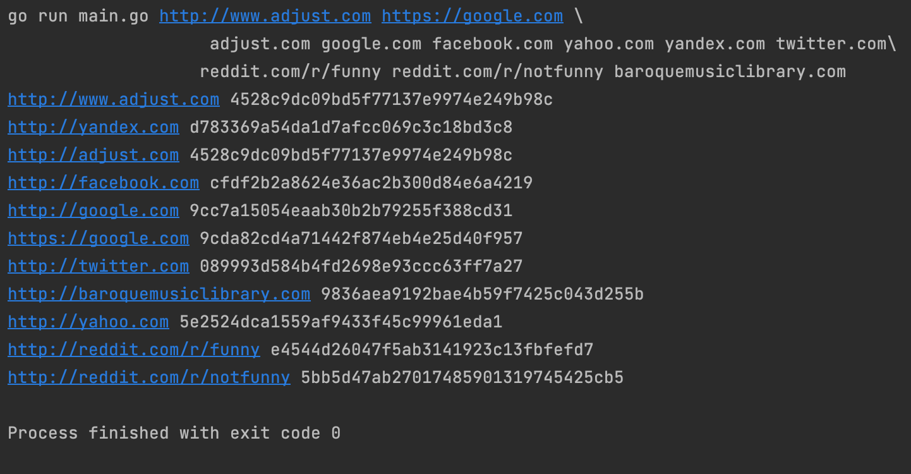
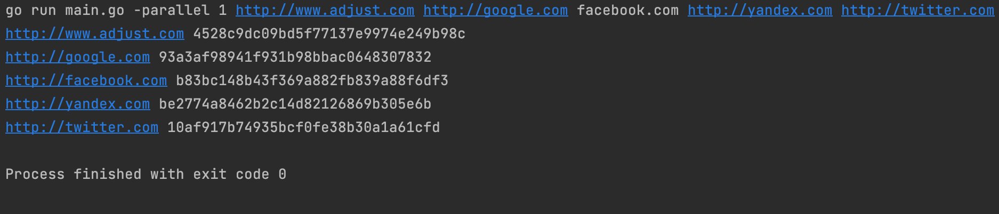
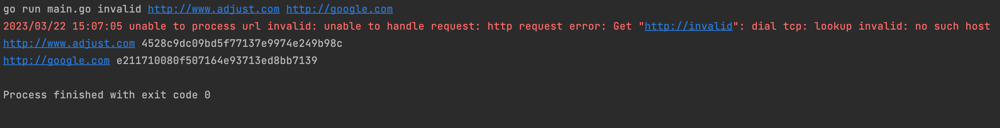
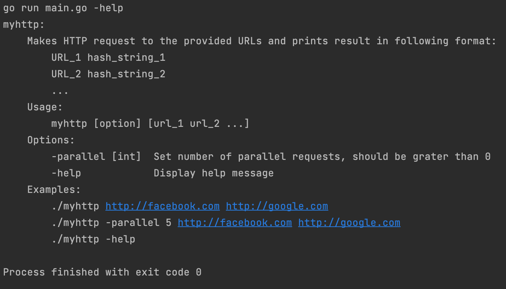

# MyHTTP
This tool makes HTTP requests to provided URLs and prints result in following format:
```
URL_1 hash_string_1
URL_2 hash_string_2
```
The tool performs the requests in parallel. By default, number of parallel requests equals to 10, but you can change it
with flag `-parallel [int]`. This number should be grater than 0. 

#### Error handling
If some invalid url provided, they will be printed to logs with error message.

## Install
```
git clone git@github.com:tpmanc/myhttp.git
```

## Requirements
* Golang v1.20+, [install](https://golang.org/doc/install)

## Build
You can build the tool with command `make build`

## Usage
```
./myhttp [option] [url_1 url_2 ...]
```

Options:
 * `-parallel [int]` Set number of parallel requests, should be grater than 0. By default, equals to 10.
 * `-help` Display help message.

Examples:
```
./myhttp http://facebook.com http://google.com
./myhttp -parallel 5 http://facebook.com http://google.com
./myhttp -help
```

## Tests
Use command `make test` to run unit tests

## Result examples
* Run with default `-parallel` value:


* Run with `-parallel 1` value:


* Run with invalid URL:


* Run help command:
